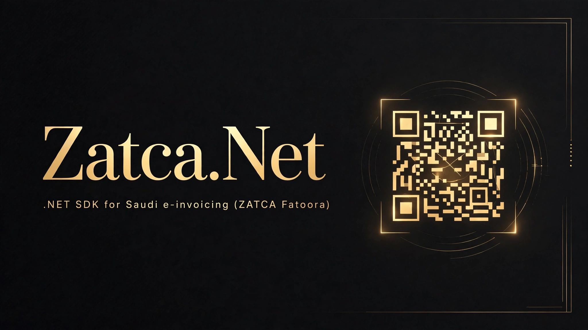

[](LICENSE)
[](https://dotnet.microsoft.com/)
[](https://github.com/SENESO/Zatca.Net/actions)
[](https://github.com/SENESO/Zatca.Net/stargazers)

# Zatca.Net

A clean, modern .NET SDK for Saudi Arabia's **ZATCA e-invoicing (Fatoora) Phase 2**: TLV QR code generation, SHA-256 invoice hashing, ECDSA (secp256k1) signing primitives, EGS onboarding (compliance → production CSIDs), and the clearance / reporting APIs.

Targets `netstandard2.0` and `net8.0`. Only dependencies: `System.Text.Json` (+ DI abstractions). Bring your own `HttpClient`.

> **Disclaimer:** community SDK, not affiliated with or endorsed by ZATCA (Zakat, Tax and Customs Authority). Always verify behavior against [ZATCA's official documentation](https://zatca.gov.sa/en/E-Invoicing/Introduction) before going live — tax compliance is your responsibility.

## Install

```bash
dotnet add package Zatca.Net
```

Or reference the project directly until the NuGet package is published.

## Quickstart — QR code

```csharp
using Zatca.Qr;

// Phase 1 style: tags 1-5
string qrPayload = QrCodeGenerator.GeneratePhase1(
    sellerName: "شركة الاختبار",
    vatNumber: "399999999900003",
    timestamp: "2026-10-08T12:00:00Z",   // ISO-8601
    invoiceTotalWithVat: "115.00",
    vatTotal: "15.00");

// Render qrPayload as a QR image with your favorite QR library.
```

Phase 2 adds the cryptographic tags (6–9):

```csharp
using Zatca.Crypto;
using Zatca.Qr;

byte[] xmlBytes = GetSignedInvoiceXml();          // your signed UBL 2.1 XML
byte[] hash = InvoiceHasher.ComputeHash(xmlBytes);

using (var signer = EcdsaInvoiceSigner.CreateSecp256k1())
{
    string qr = QrCodeGenerator.Generate(new QrData
    {
        SellerName = "شركة الاختبار",
        VatNumber = "399999999900003",
        Timestamp = "2026-10-08T12:00:00Z",
        InvoiceTotalWithVat = "115.00",
        VatTotal = "15.00",
        InvoiceHash = hash,                       // tag 6
        EcdsaSignature = signer.SignHash(hash),   // tag 7 (raw 64-byte r‖s)
        PublicKey = signer.ExportPublicKeyUncompressed(), // tag 8
        StampSignature = stampSignatureBytes     // tag 9 (simplified invoices)
    });
}
```

## Quickstart — onboarding & submission

```csharp
using Zatca;
using Zatca.Models;

var client = new ZatcaClient(new ZatcaClientOptions
{
    // defaults to the sandbox; switch BaseUrl for simulation/production
});

// 1. Compliance CSID (OTP from the Fatoora portal; "123345" on sandbox)
CsIdResponse compliance = await client.RequestComplianceCsIdAsync(csrBase64, otp);

// 2. Compliance checks with the compliance credentials
var complianceClient = client.WithCredentials(compliance.BinarySecurityToken, compliance.Secret);
await complianceClient.SubmitComplianceInvoiceAsync(new InvoiceSubmission
{
    InvoiceHash = InvoiceHasher.ComputeHashHex(signedXmlBytes),
    Uuid = invoiceUuid,
    InvoiceBase64 = Convert.ToBase64String(signedXmlBytes)
});
// ... repeat for each invoice type declared in your CSR ...

// 3. Production CSID
CsIdResponse production = await complianceClient.RequestProductionCsIdAsync(compliance.RequestId);

// 4. Report (simplified/B2C) or clear (standard/B2B) with production credentials
var prod = client.WithCredentials(production.BinarySecurityToken, production.Secret);

ZatcaSubmissionResult reported = await prod.ReportInvoiceAsync(submission); // simplified
ZatcaSubmissionResult cleared  = await prod.ClearInvoiceAsync(submission);  // standard

if (cleared.IsAccepted) { /* persist, then share with buyer */ }
```

### ASP.NET Core DI

```csharp
services.AddZatca(options =>
{
    options.BaseUrl = ZatcaClientOptions.SimulationBaseUrl;
    options.BinarySecurityToken = config["Zatca:Token"];
    options.Secret = config["Zatca:Secret"];
});
```

## API reference

### `ZatcaClient`

| Method | Endpoint | Notes |
|---|---|---|
| `RequestComplianceCsIdAsync(csrBase64, otp)` | `POST /compliance` | Headers `OTP`, `Accept-Version: V2`. No auth. |
| `SubmitComplianceInvoiceAsync(submission)` | `POST /compliance/invoices` | Basic auth with **compliance** CSID. |
| `RequestProductionCsIdAsync(complianceRequestId)` | `POST /production/csids` | Basic auth with **compliance** CSID. |
| `RenewProductionCsIdAsync(csrBase64, otp)` | `PATCH /production/csids` | Basic auth with **production** CSID + `OTP` header. |
| `ReportInvoiceAsync(submission)` | `POST /invoices/reporting/single` | `Clearance-Status: 0`. Simplified invoices, report within 24h. |
| `ClearInvoiceAsync(submission)` | `POST /invoices/clearance/single` | `Clearance-Status: 1`. Standard invoices, clear **before** sharing with buyer. |
| `WithCredentials(token, secret)` | — | New client sharing the `HttpClient`, different CSID set. |

Errors surface as `ZatcaApiException` (HTTP status + raw body).

### Crypto & QR

- `QrCodeGenerator.Generate(QrData)` / `GeneratePhase1(...)` → base64 TLV payload; `Decode(base64)` → fields (for verification).
- `InvoiceHasher.ComputeHash / ComputeHashHex / ComputeHashBase64` — SHA-256.
- `IInvoiceSigner` + `EcdsaInvoiceSigner(ECDsa)` — bring your own key; `SignHash` returns raw 64-byte r‖s; `CreateSecp256k1()` factory for supported platforms.
- `TaxInvoice` (+ `Party`, `InvoiceLine`) — domain model with `Validate()` (totals consistency, buyer required for standard, Saudi VAT format).
- `SaudiVatValidator.IsValid` — 15 digits, starts and ends with 3.

## Environments

| Environment | Base URL | OTP | CSR certificate template |
|---|---|---|---|
| Sandbox (developer portal) | `https://gw-fatoora.zatca.gov.sa/e-invoicing/developer-portal` | fixed `123345` | `TSTZATCA-Code-Signing` |
| Simulation | `https://gw-fatoora.zatca.gov.sa/e-invoicing/simulation` | from Fatoora portal | `PREZATCA-Code-Signing` |
| Production | `https://gw-fatoora.zatca.gov.sa/e-invoicing/core` | from Fatoora portal (single-use, 1h) | `ZATCA-Code-Signing` |

Notes from the official flow:
- The sandbox only validates invoices for the test VAT `399999999900003`.
- Simulation enforces the compliance gate (up to 6 sample documents: standard/simplified × invoice/credit/debit) before issuing a production CSID.
- Always branch on ZATCA's response body (`reportingStatus`/`clearanceStatus`, `validationResults.status`), not just the HTTP status.

## Honest scope

What this SDK **does**:
- TLV QR payloads (tags 1–9) per ZATCA's Security Features Implementation Standards, with decode support.
- SHA-256 hashing and ECDSA/secp256k1 signing primitives with raw r‖s output for QR tag 7.
- Typed clients for onboarding (compliance/production CSIDs, renewal) and clearance/reporting, with correct endpoints, headers and Basic auth.
- Invoice domain models with consistency validation, Saudi VAT validation.

What it **does not** do (by design):
- **UBL 2.1 XML generation** — you build the invoice XML (fields, UBLExtensions, cac:Signature skeleton) in your ERP; the SDK hashes, signs and submits it.
- **XAdES-BES enveloped signing** inside the XML — the `IInvoiceSigner` signs hash bytes; embedding the `<ds:Signature>` block is integrator work.
- **CSR generation** — generate the secp256k1 key and CSR (with ZATCA's required subject/extension fields) via OpenSSL or your CA tooling, then pass the base64 CSR in.
- Private-key storage — keys never enter this SDK except as the `ECDsa` instance you hand it; encrypt CSIDs and keys at rest.

## Development

```bash
dotnet build Zatca.sln
dotnet test Zatca.sln
```

Tests are fully offline (mocked HTTP, fixed vectors, independent golden QR bytes).

## License

MIT — see [LICENSE](LICENSE).
